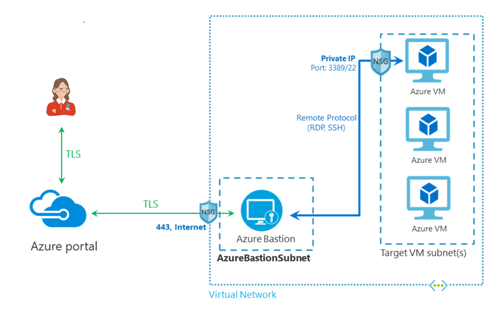

This is a terrafrom sample to provision VMs with Azure Bastion enabled.

One of the use case of using VM and Azure Bastion is for Dev, EDA (Exploratory Data Analysis) work for a global remote team which Data Residency is requested by customer.

For more information about Azure Bastion please review https://azure.microsoft.com/en-us/services/azure-bastion/

# How to start

## Prerequisites

1. Install Azure CLI & Terraform or you can open the project in Vscode Remote Container

## Steps

1. (Optional) Update number of VMs and size of them in [variables.tf](variables.tf)

2. Run `az login` in your terminal and check your azure account `az account show`

3. Run `terrafrom init`

4. Run `terraform plan -out vms.tfplan`

5. Run `terraform apply "vms.tfplan"`
